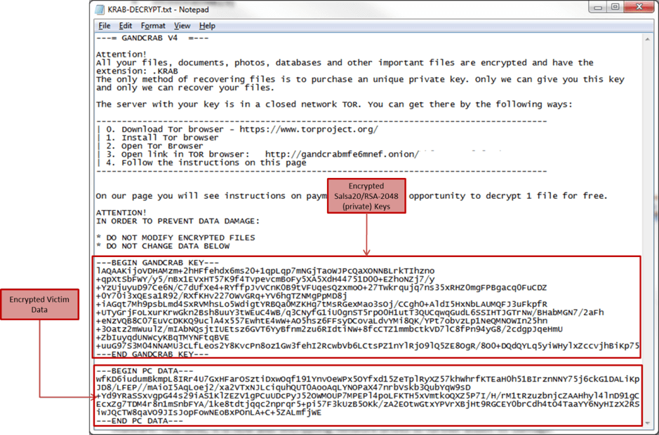
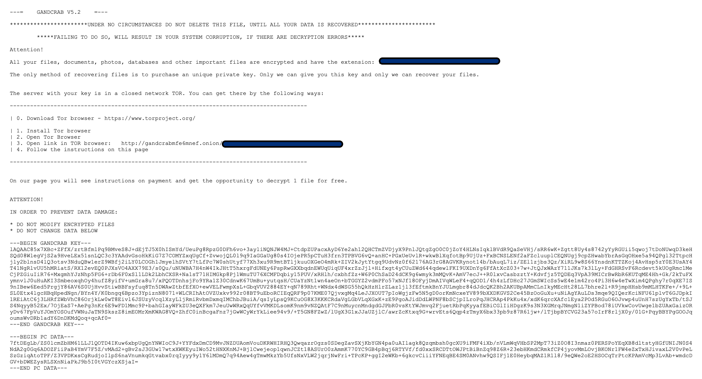
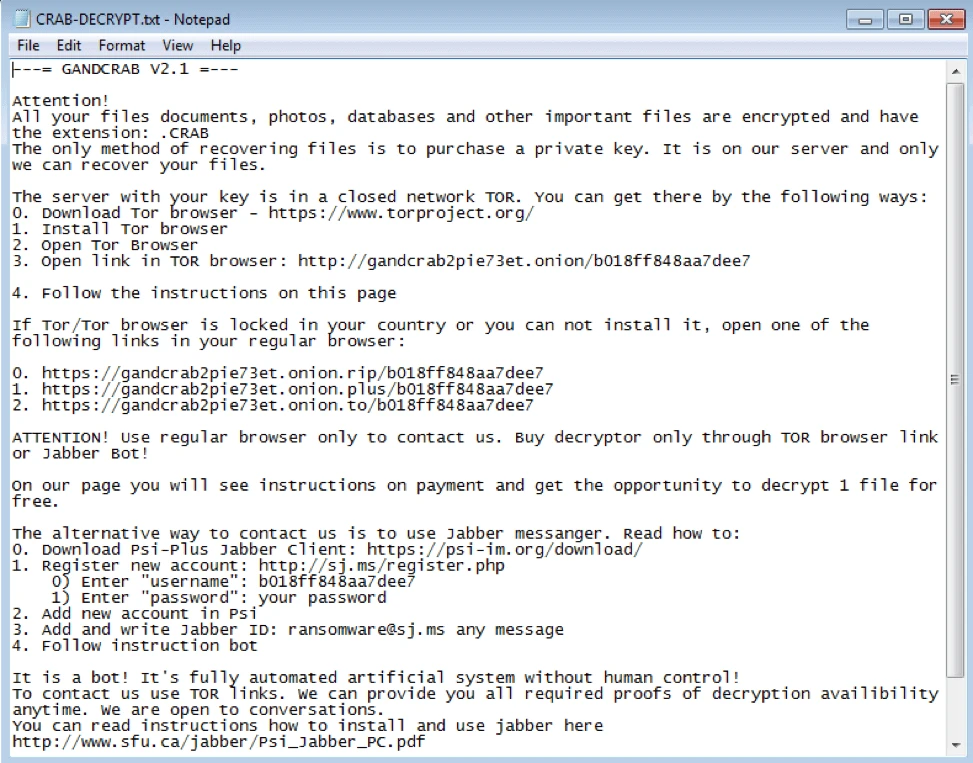

# 🛡️ GandCrab Ransomware – Complete Technical Analysis

This repository presents an in-depth analysis of the **GandCrab** ransomware, one of the most influential and widespread families within the Ransomware-as-a-Service (RaaS) ecosystem. The study covers its architecture, attack chain, cryptographic mechanisms, global impact, and mitigation recommendations.

---
## 📑 Table of Contents

1. [Introduction](#introduction)  
2. [Theoretical Framework](#theoretical-framework)  
   - [Concept of Ransomware](#21-concept-of-ransomware)  
   - [Ransomware-as-a-Service (RaaS) Model](#22-ransomware-as-a-service-raas-model)  
   - [Cryptography in Ransomware](#23-cryptography-in-ransomware)  
3. [GandCrab Description](#gandcrab-description)  
   - [History and Timeline](#31-history-and-timeline)  
   - [Language and Architecture](#32-language-and-architecture)  
   - [Infection Vectors](#33-infection-vectors)  
4. [Technical Operation](#technical-operation)  
   - [Kill Chain / MITRE ATT&CK](#41-kill-chain--mitre-attck)  
   - [Evasion and Persistence Techniques](#42-evasion-and-persistence-techniques)  
   - [Encryption Mechanism](#43-encryption-mechanism)  
   - [C2 Communication Flow](#44-c2-command-and-control-flow)  
5. [Global Impact Analysis](#global-impact-analysis)  
6. [Mitigation and Recommendations](#mitigation-and-security-recommendations)  
7. [Conclusion](#conclusion)  

---

## Introduction

**GandCrab** is considered one of the most notorious ransomware strains in recent history, emerging in 2018 under the Ransomware-as-a-Service (RaaS) model. Within a short period, it infected hundreds of thousands of victims worldwide, leveraging advanced encryption and sophisticated evasion techniques.

Its financial and operational impact was so significant that it shaped the evolution of later variants such as **REvil/Sodinokibi**, which inherited part of its codebase and operational model.

---
## Theoretical Framework

### 2.1. Concept of Ransomware

Ransomware is a type of malware that encrypts a victim’s files, making them inaccessible until a ransom is paid—usually in cryptocurrency for anonymity. Its basic operation involves infection through vectors such as malicious emails, followed by execution that locks data and displays a ransom note with payment instructions. The evolution of modern ransomware includes tactics such as double extortion, where data is exfiltrated and threatened with public release, as well as automation for mass infections and evasion techniques to avoid antivirus detection. This has transformed ransomware from isolated threats into sophisticated global campaigns affecting critical sectors such as healthcare and infrastructure.

In the modern context, ransomware families incorporate artificial intelligence to optimize attacks and exploit zero-day vulnerabilities, increasing their lethality. Double extortion, introduced in more recent variants, pressures victims not only through loss of access but also by threatening exposure of sensitive data. Additionally, automation enables large-scale distribution via exploit kits, while evasion techniques include code obfuscation and virtual environment detection. This progression reflects the professionalization of cybercrime, with groups operating similarly to legitimate companies.

### 2.2. Ransomware-as-a-Service (RaaS) Model
The RaaS ecosystem operates as a platform where developers provide ready-to-use malware, allowing affiliates to distribute it without advanced programming knowledge. Roles include developers who create and update the code, affiliates who infect victims, negotiators who manage payments, and cryptocurrency launderers who process the profits. In GandCrab, commissions ranged from 30% to 40% for the developers, with the remainder going to affiliates, incentivizing a broad network of participants. This model democratized ransomware, lowering entry barriers and expanding its global reach.

- Developers create the malware  
- Affiliates distribute it  
- Negotiators handle victims  
- Launderers process cryptocurrency  

In GandCrab, affiliates kept about **60%–70%** of the profits.  
This model *democratized cybercrime*, enabling even low-skilled actors to execute complex attacks.

### 2.3. Cryptography in Ransomware
GandCrab used hybrid encryption:

- **AES** or **Salsa20** for fast file encryption  
- **RSA-2048** to encrypt the victim’s key  

Each infection generated unique keys, preventing the use of generic decryptors.

---

## GandCrab Description

### 3.1. History and Timeline
GandCrab v1 was first detected in January 2018, marking the beginning of a wave of infections driven by the RaaS model. Version 2 introduced bug fixes and changes to the encryption algorithm for improved efficiency. In version 3, new file extensions were added, complicating identification. Version 4 migrated to Salsa20 combined with RSA, enhancing speed and security. Version 5 introduced improved anti-analysis features and new ransom notes, while 5.2 became the final release before the group’s public retirement in 2019.

This rapid evolution reflects the developers’ agility, with monthly updates designed to evade security defenses. Peak activity occurred in 2018–2019, with the group claiming billions in profits before announcing their exit. However, evidence suggests migration to REvil, which retained similar codebases.

| Version | Year | Highlights |
|---------|------|------------------------------------------|
| v1 | 2018 | First appearance, .GDCB extensions |
| v2 | 2018 | Stability fixes and improvements |
| v3 | 2018 | New extensions and evasion features |
| v4 | 2018 | Adoption of Salsa20 + RSA |
| v5 / 5.2 | 2019 | Refined anti-analysis; final version |

The authors announced their “retirement” in 2019, claiming over **$2 billion** in revenue.

---

### 3.2. Language and Architecture

- Written in **C/C++**  
- Anti-debug and anti-VM mechanisms  
- Use of **DGA (Domain Generation Algorithm)** for resilient C2 contact  
- Modular architecture enabling rapid updates  

---

### 3.3. Infection Vectors
- Exploit kits (especially **RIG EK**)  
- Phishing with malicious attachments  
- RDP vulnerabilities  
- Malvertising  

Affiliates selected their own strategies, promoting massive distribution.

---
## Technical Operation

### 4.1. Kill Chain / MITRE ATT&CK
Summary flow:

1. **Reconnaissance** – Collection of vulnerable targets  
2. **Initial Access** – Phishing / exploit kits  
3. **Execution** – Payload execution  
4. **Persistence** – Registry keys, scripts, services  
5. **Privilege Escalation**  
6. **Encryption / Exfiltration**  
7. **Impact** – Ransom note and full system lock  

---

### 4.2. Evasion and Persistence Techniques

- Sandbox detection  
- Deletion of **shadow copies**  
- Termination of processes (SQL, Exchange, backups)  
- Obfuscation and anti-debug checks  

---

### 4.3. Encryption Mechanism

Early versions used RSA + AES for hybrid encryption. Later variants adopted Salsa20 + RSA-2048 for greater speed and security. The process involved generating a unique key, encrypting selected files, sending the key to the C2 server, and creating a ransom note with a unique victim ID. Extensions such as .GDCB and .KRAB were added to the affected files.

### 4.4. C2 (Command and Control) Flow

GandCrab communicated with its Command and Control (C2) servers using highly resilient and anonymous methods. Communication used:

- **Tor network**, making tracking difficult for authorities.  
- **Domain Generation Algorithm (DGA)**, allowing dynamic generation of new domains to evade blocking.  
- **Transport-layer encryption**, ensuring transmitted data remained unreadable to traffic analysis tools.

During this communication, information such as operating system, permissions, geographic region, victim ID, and language were sent to operators, enabling attack customization and ransom pricing.

The communication followed a flow such as:

1. The malware generates a unique victim ID.  
2. It collects system and user information.  
3. It connects via Tor to a DGA-generated domain.  
4. It sends encrypted data to the C2.  
5. It receives instructions (ransom amount, custom ransom note, or keys).  

This system made GandCrab extremely difficult to disrupt, even through international efforts.

---

## 5. Global Impact Analysis

### 5.1. Relevant Statistics

GandCrab's impact was massive and widely documented:

- More than **500,000 victims** between 2018 and 2019.  
- Millions of dollars exchanged in **Bitcoin and Dash**, the latter chosen due to its stronger anonymity features.  
- Represented approximately **40% of all ransomware infections** worldwide at its peak.  
- Affected:
  - Large enterprises  
  - Small and medium businesses (SMBs)  
  - Home users  
  - Critical infrastructure (healthcare, finance, public services)

Its affiliate-based distribution model contributed heavily to its rapid global expansion.

---

### 5.2. GandCrab “Retirement”

In June 2019, the operators announced their “retirement,” claiming:

- Profits exceeding **2 billion dollars**  
- That they had “achieved all financial goals”

However, researchers identified:

- Strong similarities between GandCrab and the newly risen **REvil/Sodinokibi**  
- Reuse of techniques, infrastructure elements, and even coding patterns  

This suggests the operators simply migrated to a more advanced brand.

---

### 5.3. Law Enforcement Response

International pressure against GandCrab was significant:

- **Europol**, together with **Bitdefender**, released multiple **free decryptors**, helping thousands of victims.  
- Joint efforts took down several servers used by early GandCrab versions.  
- Collaboration among governments, CERTs, and research labs accelerated the group's decline.

Even so, the emergence of REvil demonstrated that the RaaS ecosystem remains adaptive and resilient.

---

## 6. Security Mitigations and Recommendations

### 6.1. Preventive Measures

Prevention is the most important layer against ransomware:

- Hardening RDP:
  - Complex passwords  
  - IP restrictions  
  - Changing default RDP port  
- Mandatory **MFA (Multi-Factor Authentication)**  
- Continuous patching of systems and applications  
- Email security solutions with:
  - Anti-phishing filters  
  - Attachment sandboxing  
  - Blocking untrusted macros  

---

### 6.2. Technical Mitigations

To reduce impact and increase resilience:

- Use **EDR (Endpoint Detection and Response)** with behavioral monitoring  
- Implement **Application Allowlisting** to block unauthorized executables  
- Maintain **offline and immutable backups**, tested frequently  
- Protect shadow copies from malicious deletion, preventing abuse of `vssadmin`  

---

### 6.3. Incident Response

If ransomware executes:

1. **Immediately isolate** the affected endpoint (network, Wi-Fi, VPN).  
2. Collect and analyze **IOCs** (hashes, domains, processes, mutexes).  
3. Check for updated decryptors at **NoMoreRansom.org**.  
4. Report the incident to authorities and internal security teams.  
5. Reinstall the system or restore from a trusted backup.  
6. Review the security failures that allowed the infection.

---

## 7. Conclusion

**GandCrab** made history in cybersecurity by establishing the Ransomware-as-a-Service model as the dominant standard.  
Through its combination of:

- Advanced hybrid encryption  
- Anti-analysis evasion  
- Rapid and continuous updates  
- A structured affiliate ecosystem  
- Highly resilient C2 infrastructure  

GandCrab became the most widespread ransomware in the world until 2019.

Even after its “retirement,” its legacy continues through **REvil**, proving that cybercrime evolves rapidly and in an organized manner.

Its study reinforces the need for:

- Modern strategies such as Zero Trust  
- Continuous monitoring with EDR  
- Immutable backups  
- Global cooperation against ransomware  

The evolution of GandCrab demonstrates that sophisticated threats require equally sophisticated defenses.

